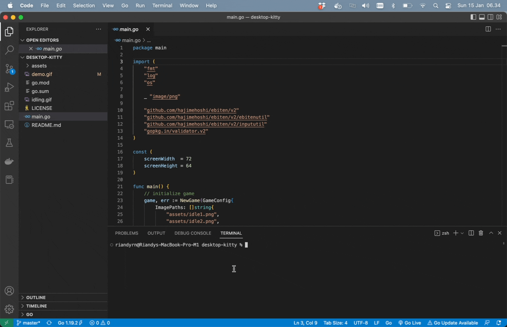

# Desktop Cat Go


Desktop kitty that keeps you company.

Ported to Go from [Desktop Cat](https://github.com/daywa1kr/Desktop-Cat) project written in Python by [daywa1kr](https://github.com/daywa1kr).

Intended as fun project to help kids & teens getting started with Go programming.

## Features

- Kitty animation (currently she has only 1 animation)
- Draggable kitty
- Exit button

## How to Run

This project is built using [Ebitengine v2](https://ebitengine.org/). So make sure it is installed properly before running this project.

To run this project, type following command in console:

```
go run *.go
```

Upon successful execution the kitty will appears on your desktop just like shown in [Demo](#demo).

## Demo

